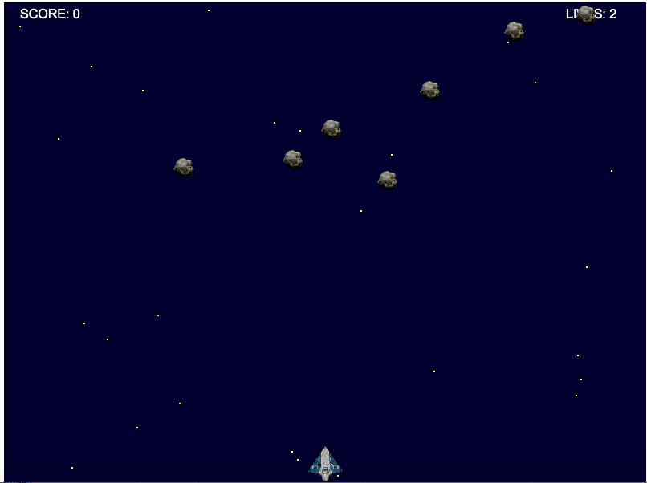

## Space Rocket Canvas game

Author: Adnan Ibric

#### Installation

1. Clone the repository

```sh
$ git clone https://github.com/aibric1407/space_rocket_game.git
```

2. Run the app

```sh
$ cd space_rocket_game
```

Open `index.html` file in browser:



#### Description

Game consists from:

- Space ship which can move to every direction in 2D and can shoot the bullets
- Asteroids which are generated randomly and falling from top to bottom of screen

Objective is not to collide with asteroids and destroy as much asteroids as you can.

For each destroyed asteroid user gets 10 points.

Each collision will take one live out of three.

When user reaches 0 lives game is over.
